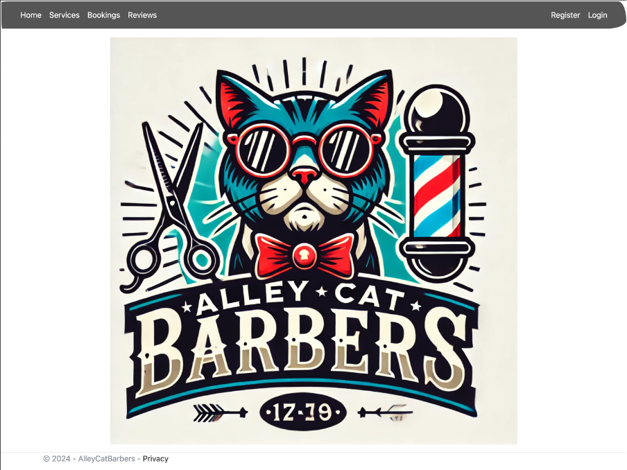

# AlleyCat Barbers

_Initial Build: Aug 2024_

A web-based barber shop management system built with ASP.NET Core 8.0. Supports appointment booking, service management, customer reviews, and email communications — with role-based access for admins, staff, and customers.



## Tech Stack

- **Framework:** ASP.NET Core 8.0 (MVC + Razor Pages)
- **Database:** Azure SQL Database
- **ORM:** Entity Framework Core 8.0
- **Authentication:** ASP.NET Identity + Google OAuth
- **Email:** Azure Communication Services
- **Frontend:** Bootstrap, jQuery, jQuery UI, FullCalendar, DataTables

## Features

- **Bookings** — Create, view, edit, and cancel appointments with time slot selection
- **Services** — Admin-managed service catalog with pricing
- **Reviews** — Customer reviews with star ratings
- **User Management** — Admin panel for managing customers and staff
- **Email** — Send bulk emails with attachments via Azure Communication Services
- **Role-Based Access** — Three roles: `Admin`, `Staff`, `Customer`
- **Google Login** — OAuth sign-in via Google

## Getting Started

### Prerequisites

- [.NET 8.0 SDK](https://dotnet.microsoft.com/download)
- An Azure SQL Database instance with a valid connection string
- (Optional) Azure Communication Services account for email

### Setup

1. **Clone the repository**

   ```bash
   git clone <repo-url>
   cd AlleyCatBarbers
   ```

2. **Configure settings**

   Sensitive values should be stored using [.NET User Secrets](https://learn.microsoft.com/en-us/aspnet/core/security/app-secrets):

   ```bash
   dotnet user-secrets set "ConnectionStrings:DefaultConnection" "<your-azure-sql-connection-string>"
   dotnet user-secrets set "Authentication:Google:ClientId" "<your-client-id>"
   dotnet user-secrets set "Authentication:Google:ClientSecret" "<your-client-secret>"
   dotnet user-secrets set "AzureCommunicationServices:ConnectionString" "<your-connection-string>"
   ```

3. **Apply database migrations**

   ```bash
   dotnet ef database update
   ```

4. **Run the application**

   ```bash
   dotnet run
   ```

   The app will be available at `https://localhost:7195` or `http://localhost:5121`.

### Seeded Accounts

The database is pre-seeded with the following test accounts:

| Email                 | Password | Role     |
| --------------------- | -------- | -------- |
| admin@admin.com       | password | Admin    |
| staff@staff.com       | password | Staff    |
| customer@customer.com | password | Customer |

Additional mock users are loaded from `Data/MOCK_USERS.csv` on startup.

> **Note:** Password requirements are intentionally relaxed for development. Strengthen them in `Program.cs` before deploying to production.

## Project Structure

```
AlleyCatBarbers/
├── Controllers/        # MVC controllers (Bookings, Services, Reviews, Users, Emails)
├── Models/             # Entity models (Booking, Service, Review, ApplicationUser)
├── ViewModels/         # DTOs for views
├── Views/              # Razor templates
├── Services/           # Email sender and CSV reader
├── Data/               # DbContext, migrations, seed data
├── Areas/Identity/     # Login, registration, account management pages
└── wwwroot/            # Static assets (CSS, JS, images)
```

## Database Schema

| Table    | Key Fields                                                   |
| -------- | ------------------------------------------------------------ |
| Users    | Extended Identity user with FirstName, LastName, DateOfBirth |
| Services | Type, Price, Description                                     |
| Bookings | Date, TimeSlot, ServiceId, UserId                            |
| Reviews  | Rating (1–5), Comments, UserId, DateCreated                  |

## Common Commands

```bash
dotnet build                          # Build the project
dotnet run                            # Run locally
dotnet ef migrations add <Name>       # Create a new migration
dotnet ef database update             # Apply pending migrations
```

\*\*README generated using Claude Code
